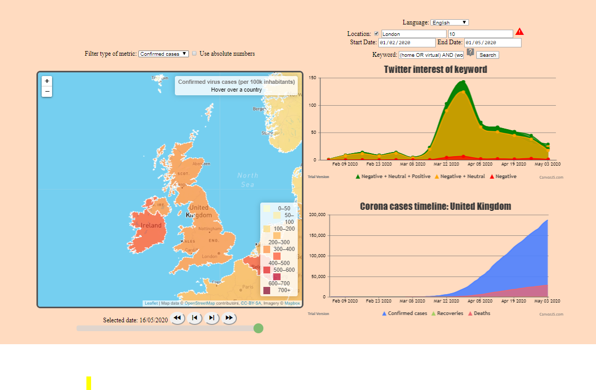

# BDS PROJECT 2020 - GROUP 29

## Overview

- [General Idea](#general-idea)
- [Getting Started](#getting-started)
- [Use](#use)
- [Example](#example)
- [Acknowledgement](#acknowledgement)

## General Idea

The COVID-19 pandemic is shaking up our daily lives and has resulted in a series of odd trends. Suddenly people have started hoarding toilet paper, shaving their heads bald and collectively baking their own bread. This has lead to empty shelves in the toilet paper aisle and an increased (online) sale of electric hair clippers and bread machines. Due to limited real life social interaction, social media plays an even bigger role in the spreading and adaptation of these trends than usual. Consequently, noticing them early could enable unique business/humanitarian/political opportunities.

This tool allows a user to provide one or more keywords (such as "bread machine") and a location (e.g. "Belgium") and returns the evolution of twitter's interest in that keyword based on number of tweets/retweets involving that keyword during a certain time window. In addition, an existing COVID-19 Data API is used to also identify the evolution of number of contaminated/dead/recovered patients during that time window for that location. The necessary visualizations for both enable a user to correlate the interest in certain products/terms to the stage of the crisis that a location is in. Future business (and in parallel humanitarian) opportunities can then be discovered for locations that are currently behind on the curve.

## Getting started

### Prerequisites

- python3 (explicitly tested for python 3.6.9 and 3.7.1)
- pip

### Installation

#### Clone the repository

```sh
# clone
git clone https://github.ugent.be/agvdndor/bds-project-2020.git

# change directory
cd bds-project-2020/
```

#### Setting up the environment

```sh
# install virtualenv
pip install virtualenv

# create the environment
virtualenv -p python3 venv

# activate the environment
## Linux/Mac
source venv/bin/activate
## Windows
venv\Scripts\activate

# install dependencies
pip install -r requirements.txt
```

#### Start flask server

```sh
# indicate flask app source file
## Linux/Mac
export FLASK_APP=server.py
## Windows (powershell)
$env:FLASK_APP="server.py"
## Windows (other)
edit environment variables using the control panel


# run flask
python -m flask run
```

## Use

After starting the flask server, the tool can be accessed at [localhost:5000](http:localhost:5000)

- Use the slider or buttons under the world map to explore the evolution of the spread of the pandemic on a global scale.
- Click on a country in the map panel to see the detailed evolution of covid cases in that country.
- Use the search fields on the top right to show the number of tweets in combination with a basic sentiment analysis by specifying:
  - **language**: auto-determined by twitter
  - **location and radius**: be cautious, users that have not enabled location might be filtered out by using this option, but not using this option results in significantly longer query times
  - **start date** and **end date**: to bound the query in time
  - **keyword**: this field allows for advanced queries, e.g. "(homemade OR artisanal) AND (bread OR pastry)"

*The user should be aware that this tool does **not** use the (paid) premium twitter API. Hence, very generic twitter search options will result in a long loading time as we parse live twitter data.*

## Example

Suppose we want to know what the impact was of the pandemic on people's workout habits. More specifically, was there a trend of people working out frome home and thus needing their own gym equipment? Furthermore, how did this trend evolve during the lockdown? We will focus our analysis on the United Kingdom and choose London as a representative location for Twitter behavior. (query = "(home OR virtual) AND (workout OR gym)")



The figure seems to confirm our suspicion that there was a significant shift in workout habits. Especially during the beginning of the pandemic in the UK there was a peak in the popularity of home workouts, according to Twitter.

## Acknowledgements

- [covid19 timeseries](https://github.com/pomber/covid19): JSON time-series of coronavirus cases (confirmed, deaths and recovered) per country - updated daily
- [twitterscraper](https://github.com/taspinar/twitterscraper): One of the bigger disadvantages of the Search API is that you can only access Tweets written in the past 7 days. This is a major bottleneck for anyone looking for older past data to make a model from. With TwitterScraper there is no such limitation.
